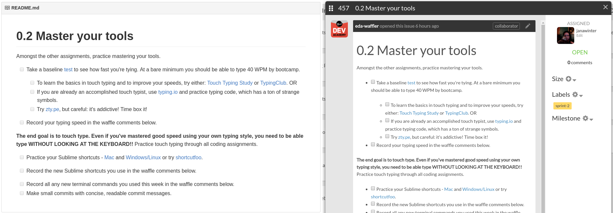

# Waffler: The Revenge

Harvest READMEs from one repository and post them as issues on another, for use in curriculum delivery via [Waffle.io](https://waffle.io).

## Usage

WTR works using separate directories whose names bear a prefix with a version number. Currently, only major and minor versions are supported.

### Post an entire major version

Given the directories:

    1.0-introduction
    1.1-overview
    1.2-details
    1.3-conclusion

the command

    $ wtr push -s 1 -c foo-bar

will push one issue for each directory, for all users of team `foo-bar` from GitHub organisation `foo-bar` on repository `foo-bar`. The body of the first issue will be drawn from `1.0-introduction/README`, and the title of the issue will be taken from the first line of the same README.

WTR will attempt to post the issues in reverse order, so that the highest version number shows up last when viewed.

### Post a minor version

Posting individual version numbers works too, just specify the minor version:

    # Post a single issue for each member of foo-bar
    $ wtr push -s 1.0 -c foo-bar

### Source READMEs

Currently, the source location is hardwired to `dev-academy-programme` org, `curriculum-private` repo, `assignments` folder.

### Authentication

WTR looks for the environment variable `WTR_ACCESS_TOKEN`. Export any GitHub personal access token:

    $ export WTR_ACCESS_TOKEN=1234567890

The token must have the _repo_ and _org:read_ permissions for the target organisation/repo and _repo_ permissions for the source repo. Although you _could_ use one of your own, if you're reading this and are on the EDA teaching staff, ask in the Phase 0 chat for someone to add a token for you.

## Rate limiting

GitHub has a 5000 request/hour limit for authenticated users, but they also have [rate limit abuse guidelines](https://developer.github.com/guides/best-practices-for-integrators/#dealing-with-abuse-rate-limits). To avoid falling foul of these, WTR inserts a delay between each POST request which can make execution a little slow for large issue batches.

## Credits

[Pete Jacobson] wrote [the original Waffler tool](). Pete is awesome. 
